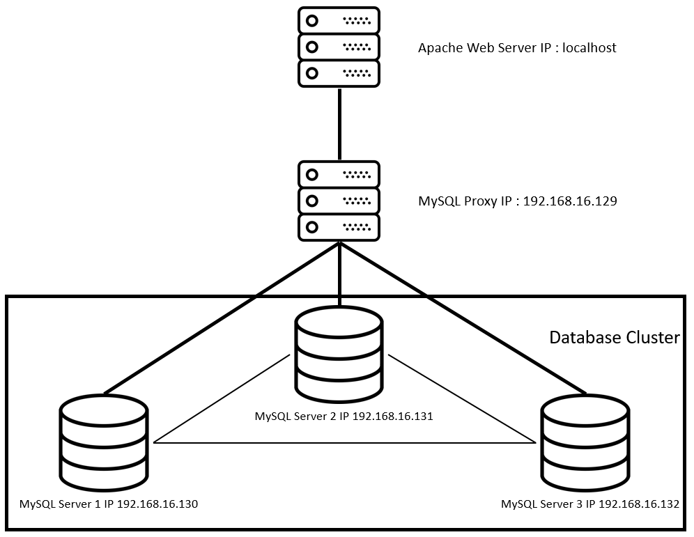

# Arsitektur Sistem
Frandita Adhitama (05111640000129)

## Table Of Content
- [1. Desain dan Implementasi Infrastruktur](https://github.com/odeloen/basis-data-terdistribusi/tree/master/ets#1-desain-dan-implementasi-infrastruktur)
  - [1.1 Desain Infrastruktur](https://github.com/odeloen/basis-data-terdistribusi/tree/master/ets#11-desain-infrastruktur)
  - [1.2 Implementasi Infrastruktur](https://github.com/odeloen/basis-data-terdistribusi/tree/master/ets#12-implementasi-infrastruktur)
    - [Tahapan Konfigurasi](https://github.com/odeloen/basis-data-terdistribusi/tree/master/ets#tahapan-konfigurasi)
- [2. Penggunaan Basis Data Terdistribusi dalam Aplikasi](https://github.com/odeloen/basis-data-terdistribusi/tree/master/ets#2-penggunaan-basis-data-terdistribusi-dalam-aplikasi)
  - [simKP-mamet](https://github.com/odeloen/basis-data-terdistribusi/tree/master/ets#simkp-mamet)
  - [Konfigurasi simKP-mamet](https://github.com/odeloen/basis-data-terdistribusi/tree/master/ets#konfigurasi-simkp-mamet)
- [3. Simulasi Fail Over](https://github.com/odeloen/basis-data-terdistribusi/tree/master/ets#3-simulasi-fail-over)

## 1. Desain dan Implementasi Infrastruktur
### 1.1 Desain Infrastruktur


Spesifikasi:
- MySQL Server 1 (192.168.16.130) : Ubuntu 16.04 RAM 512MB  
- MySQL Server 2 (192.168.16.131) : Ubuntu 16.04 RAM 512MB  
- MySQL Server 3 (192.168.16.132) : Ubuntu 16.04 RAM 512MB  
- MySQL Proxy (192.168.16.129) : Ubuntu 16.04 RAM 512MB  
- Apache Web Server (localhost) : Windows 10 RAM 4096MB  

### 1.2 Implementasi Infrastruktur
Aplikasi yang perlu diinstall:
- Vagrant(versi 2.2.5)
- Virtual Box(versi 6.0.12)

#### Tahapan Konfigurasi
- Membuat `Vagrantfile`<br>
  ```
  vagrant init
  ```
  Jalankan pada _command line_
- Memodifikasi `Vagrantfile` sesuai dengan desain infrastruktur di atas.
  ```ruby

  ```
- Membuat File Script Provisioning
  - Provisioning pada Database
    - DB1
    - DB2
    - DB3
  - Provisioning pada Load Balancer

- Membuat File Konfigurasi SQL
  - Konfigurasi db1
  - Konfigurasi db2
  - Konfigurasi db3
  
- Membuat File Script SQL Pendukung
  - File `addition_to_sys.sql`
  - File `cluster_bootstrap.sql`
  - File `cluster_member.sql`
  - File `cluster_proxysql_user.sql`
  - File `proxysql.sql`

- Menjalankan Vagrant
  ```
  vagrant up
  ```
  Jalankan pada _command line_

  Untuk mengecek hasil melakukan `vagrant up`, tulis command berikut pada _command line_
  ```
  vagrant status
  ```

- Melakukan konfigurasi tambahan pada proxy
  - Masuk ke virtual machine proxy terlebih dahulu
    ```
    vagrant ssh proxy
    ```
  - Jalankan command di bawah untuk memasukkan file proxysql.sqp sebagai provisioning tambahan
    ```
    mysql -u admin -padmin -h 127.0.0.1 -P 6032 < /vagrant/proxysql.sql
    ```

## 2. Penggunaan Basis Data Terdistribusi dalam Aplikasi
### simKP-mamet
simKP-mamet merupakan sistem informasi yang digunakan untuk memonitoring kerja praktik pada Departemen Teknik Material ITS. Aplikasi ini dikembangkan menggunakan laravel.

### Konfigurasi simKP - mamet
- Instalasi<br>
- Konfigurasi `.env`<br>
- Me-_generate key_<br>
- Menjalankan _laravel migration and seeding_<br>
- Menjalankan aplikasi pada localhost<br>

## 3. Simulasi Fail Over
- Mematikan Salah Satu Server Basis Data
- Melakukan Pengubahan Data pada Aplikasi
- Mengaktifkan Kembali Server yang Dimatikan dan Mengecek Replikasi
