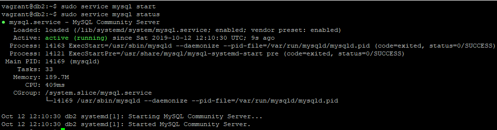

# Arsitektur Sistem
Frandita Adhitama (05111640000129)

## Table Of Content
- [1. Desain dan Implementasi Infrastruktur](https://github.com/odeloen/basis-data-terdistribusi/tree/master/ets#1-desain-dan-implementasi-infrastruktur)
  - [1.1 Desain Infrastruktur](https://github.com/odeloen/basis-data-terdistribusi/tree/master/ets#11-desain-infrastruktur)
  - [1.2 Implementasi Infrastruktur](https://github.com/odeloen/basis-data-terdistribusi/tree/master/ets#12-implementasi-infrastruktur)
    - [Tahapan Konfigurasi](https://github.com/odeloen/basis-data-terdistribusi/tree/master/ets#tahapan-konfigurasi)
- [2. Penggunaan Basis Data Terdistribusi dalam Aplikasi](https://github.com/odeloen/basis-data-terdistribusi/tree/master/ets#2-penggunaan-basis-data-terdistribusi-dalam-aplikasi)
  - [simKP-mamet](https://github.com/odeloen/basis-data-terdistribusi/tree/master/ets#simkp-mamet)
  - [Konfigurasi simKP-mamet](https://github.com/odeloen/basis-data-terdistribusi/tree/master/ets#konfigurasi-simkp-mamet)
- [3. Simulasi Fail Over](https://github.com/odeloen/basis-data-terdistribusi/tree/master/ets#3-simulasi-fail-over)

## 1. Desain dan Implementasi Infrastruktur
### 1.1 Desain Infrastruktur


Spesifikasi:
- MySQL Server 1 (192.168.16.130) : Ubuntu 16.04 RAM 512MB  
- MySQL Server 2 (192.168.16.131) : Ubuntu 16.04 RAM 512MB  
- MySQL Server 3 (192.168.16.132) : Ubuntu 16.04 RAM 512MB  
- MySQL Proxy (192.168.16.129) : Ubuntu 16.04 RAM 512MB  
- Apache Web Server (localhost) : Windows 10 RAM 4096MB  

### 1.2 Implementasi Infrastruktur
Aplikasi yang perlu diinstall:
- Vagrant(versi 2.2.5)
- Virtual Box(versi 6.0.12)

#### Tahapan Konfigurasi
- Membuat `Vagrantfile`<br>
  ```
  vagrant init
  ```
  Jalankan pada _command line_
- Memodifikasi `Vagrantfile` sesuai dengan desain infrastruktur di atas.
  ```ruby
    # -*- mode: ruby -*-
    # vi: set ft=ruby :

    # All Vagrant configuration is done below. The "2" in Vagrant.configure
    # configures the configuration version (we support older styles for
    # backwards compatibility). Please don't change it unless you know what
    # you're doing.

    Vagrant.configure("2") do |config|

        # MySQL Cluster dengan 3 node
        (0..2).each do |i|
            config.vm.define "db#{i}" do |node|
            node.vm.hostname = "db#{i}"
            node.vm.box = "bento/ubuntu-16.04"
            node.vm.network "private_network", ip: "192.168.16.13#{i}"

            # Opsional. Edit sesuai dengan nama network adapter di komputer
            #node.vm.network "public_network", bridge: "Qualcomm Atheros QCA9377 Wireless Network Adapter"
            
            node.vm.provider "virtualbox" do |vb|
                vb.name = "db#{i}"
                vb.gui = false
                vb.memory = "512"
            end

            node.vm.provision "shell", path: "deployMySQL13#{i}.sh", privileged: false
            end
        end

        config.vm.define "proxy" do |proxy|
            proxy.vm.hostname = "proxy"
            proxy.vm.box = "bento/ubuntu-16.04"
            proxy.vm.network "private_network", ip: "192.168.16.129"
            #proxy.vm.network "public_network",  bridge: "Qualcomm Atheros QCA9377 Wireless Network Adapter"
            
            proxy.vm.provider "virtualbox" do |vb|
            vb.name = "proxy"
            vb.gui = false
            vb.memory = "512"
            end

            proxy.vm.provision "shell", path: "deployProxySQL.sh", privileged: false
        end
    end
  ```
- Membuat File Script Provisioning
  - Provisioning pada Database
    - DB1 (**deployMySQL130**)
        ```sh
        # Changing the APT sources.list to kambing.ui.ac.id
        sudo cp '/vagrant/sources.list' '/etc/apt/sources.list'

        # Updating the repo with the new sources
        sudo apt-get update -y

        # Install required library
        sudo apt-get install libaio1
        sudo apt-get install libmecab2

        # Get MySQL binaries
        curl -OL https://dev.mysql.com/get/Downloads/MySQL-5.7/mysql-common_5.7.23-1ubuntu16.04_amd64.deb
        curl -OL https://dev.mysql.com/get/Downloads/MySQL-5.7/mysql-community-client_5.7.23-1ubuntu16.04_amd64.deb
        curl -OL https://dev.mysql.com/get/Downloads/MySQL-5.7/mysql-client_5.7.23-1ubuntu16.04_amd64.deb
        curl -OL https://dev.mysql.com/get/Downloads/MySQL-5.7/mysql-community-server_5.7.23-1ubuntu16.04_amd64.deb

        # Setting input for installation
        sudo debconf-set-selections <<< 'mysql-community-server mysql-community-server/root-pass password admin'
        sudo debconf-set-selections <<< 'mysql-community-server mysql-community-server/re-root-pass password admin'

        # Install MySQL Community Server
        sudo dpkg -i mysql-common_5.7.23-1ubuntu16.04_amd64.deb
        sudo dpkg -i mysql-community-client_5.7.23-1ubuntu16.04_amd64.deb
        sudo dpkg -i mysql-client_5.7.23-1ubuntu16.04_amd64.deb
        sudo dpkg -i mysql-community-server_5.7.23-1ubuntu16.04_amd64.deb

        # Allow port on firewall
        sudo ufw allow 33061
        sudo ufw allow 3306

        # Copy MySQL configurations
        sudo cp /vagrant/my130.cnf /etc/mysql/my.cnf

        # Restart MySQL services
        sudo service mysql restart

        # Cluster bootstrapping
        sudo mysql -u root -padmin < /vagrant/cluster_bootstrap.sql
        sudo mysql -u root -padmin < /vagrant/addition_to_sys.sql
        sudo mysql -u root -padmin < /vagrant/create_proxysql_user.sql
        ```
    - DB2 (**deployMySQL131**)
        ```sh
        # Changing the APT sources.list to kambing.ui.ac.id
        sudo cp '/vagrant/sources.list' '/etc/apt/sources.list'

        # Updating the repo with the new sources
        sudo apt-get update -y

        # Install required library
        sudo apt-get install libaio1
        sudo apt-get install libmecab2

        # Get MySQL binaries
        curl -OL https://dev.mysql.com/get/Downloads/MySQL-5.7/mysql-common_5.7.23-1ubuntu16.04_amd64.deb
        curl -OL https://dev.mysql.com/get/Downloads/MySQL-5.7/mysql-community-client_5.7.23-1ubuntu16.04_amd64.deb
        curl -OL https://dev.mysql.com/get/Downloads/MySQL-5.7/mysql-client_5.7.23-1ubuntu16.04_amd64.deb
        curl -OL https://dev.mysql.com/get/Downloads/MySQL-5.7/mysql-community-server_5.7.23-1ubuntu16.04_amd64.deb

        # Setting input for installation
        sudo debconf-set-selections <<< 'mysql-community-server mysql-community-server/root-pass password admin'
        sudo debconf-set-selections <<< 'mysql-community-server mysql-community-server/re-root-pass password admin'

        # Install MySQL Community Server
        sudo dpkg -i mysql-common_5.7.23-1ubuntu16.04_amd64.deb
        sudo dpkg -i mysql-community-client_5.7.23-1ubuntu16.04_amd64.deb
        sudo dpkg -i mysql-client_5.7.23-1ubuntu16.04_amd64.deb
        sudo dpkg -i mysql-community-server_5.7.23-1ubuntu16.04_amd64.deb

        # Allow port on firewall
        sudo ufw allow 33061
        sudo ufw allow 3306

        # Copy MySQL configurations
        sudo cp /vagrant/my131.cnf /etc/mysql/my.cnf

        # Restart MySQL services
        sudo service mysql restart

        # Cluster bootstrapping
        sudo mysql -u root -padmin < /vagrant/cluster_member.sql
        ```
    - DB3 (**deployMySQL132**)
        ```sh
        # Changing the APT sources.list to kambing.ui.ac.id
        sudo cp '/vagrant/sources.list' '/etc/apt/sources.list'

        # Updating the repo with the new sources
        sudo apt-get update -y

        # Install required library
        sudo apt-get install libaio1
        sudo apt-get install libmecab2

        # Get MySQL binaries
        curl -OL https://dev.mysql.com/get/Downloads/MySQL-5.7/mysql-common_5.7.23-1ubuntu16.04_amd64.deb
        curl -OL https://dev.mysql.com/get/Downloads/MySQL-5.7/mysql-community-client_5.7.23-1ubuntu16.04_amd64.deb
        curl -OL https://dev.mysql.com/get/Downloads/MySQL-5.7/mysql-client_5.7.23-1ubuntu16.04_amd64.deb
        curl -OL https://dev.mysql.com/get/Downloads/MySQL-5.7/mysql-community-server_5.7.23-1ubuntu16.04_amd64.deb

        # Setting input for installation
        sudo debconf-set-selections <<< 'mysql-community-server mysql-community-server/root-pass password admin'
        sudo debconf-set-selections <<< 'mysql-community-server mysql-community-server/re-root-pass password admin'

        # Install MySQL Community Server
        sudo dpkg -i mysql-common_5.7.23-1ubuntu16.04_amd64.deb
        sudo dpkg -i mysql-community-client_5.7.23-1ubuntu16.04_amd64.deb
        sudo dpkg -i mysql-client_5.7.23-1ubuntu16.04_amd64.deb
        sudo dpkg -i mysql-community-server_5.7.23-1ubuntu16.04_amd64.deb

        # Allow port on firewall
        sudo ufw allow 33061
        sudo ufw allow 3306

        # Copy MySQL configurations
        sudo cp /vagrant/my132.cnf /etc/mysql/my.cnf

        # Restart MySQL services
        sudo service mysql restart

        # Cluster bootstrapping
        sudo mysql -u root -padmin < /vagrant/cluster_member.sql
        ```
  - Provisioning pada Load Balancer (**deployProxySQL**)
    ```sh
    # Changing the APT sources.list to kambing.ui.ac.id
    sudo cp '/vagrant/sources.list' '/etc/apt/sources.list'

    # Updating the repo with the new sources
    sudo apt-get update -y

    cd /tmp
    curl -OL https://github.com/sysown/proxysql/releases/download/v1.4.4/proxysql_1.4.4-ubuntu16_amd64.deb
    curl -OL https://dev.mysql.com/get/Downloads/MySQL-5.7/mysql-common_5.7.23-1ubuntu16.04_amd64.deb
    curl -OL https://dev.mysql.com/get/Downloads/MySQL-5.7/mysql-community-client_5.7.23-1ubuntu16.04_amd64.deb
    curl -OL https://dev.mysql.com/get/Downloads/MySQL-5.7/mysql-client_5.7.23-1ubuntu16.04_amd64.deb

    sudo apt-get install libaio1
    sudo apt-get install libmecab2

    sudo dpkg -i proxysql_1.4.4-ubuntu16_amd64.deb
    sudo dpkg -i mysql-common_5.7.23-1ubuntu16.04_amd64.deb
    sudo dpkg -i mysql-community-client_5.7.23-1ubuntu16.04_amd64.deb
    sudo dpkg -i mysql-client_5.7.23-1ubuntu16.04_amd64.deb

    sudo ufw allow 33061
    sudo ufw allow 3306

    sudo systemctl start proxysql
    # Jalankan line dibawah ini langsung pada server proxy
    # mysql -u admin -padmin -h 127.0.0.1 -P 6032 < /vagrant/proxysql.sql
    ```

- Membuat File Konfigurasi SQL
  - Konfigurasi db1 (**my130.cnf**)
    ```ini    
    !includedir /etc/mysql/conf.d/
    !includedir /etc/mysql/mysql.conf.d/

    [mysqld]

    # General replication settings
    gtid_mode = ON
    enforce_gtid_consistency = ON
    master_info_repository = TABLE
    relay_log_info_repository = TABLE
    binlog_checksum = NONE
    log_slave_updates = ON
    log_bin = binlog
    binlog_format = ROW
    transaction_write_set_extraction = XXHASH64
    loose-group_replication_bootstrap_group = OFF
    loose-group_replication_start_on_boot = ON
    loose-group_replication_ssl_mode = REQUIRED
    loose-group_replication_recovery_use_ssl = 1

    # Shared replication group configuration
    loose-group_replication_group_name = "8f22f846-9922-4139-b2b7-097d185a93cb"
    loose-group_replication_ip_whitelist = "192.168.16.130, 192.168.16.131, 192.168.16.132"
    loose-group_replication_group_seeds = "192.168.16.130:33061, 192.168.16.131:33061, 192.168.16.132:33061"

    # Single or Multi-primary mode? Uncomment these two lines
    # for multi-primary mode, where any host can accept writes
    loose-group_replication_single_primary_mode = OFF
    loose-group_replication_enforce_update_everywhere_checks = ON

    # Host specific replication configuration
    server_id = 130
    bind-address = "192.168.16.130"
    report_host = "192.168.16.130"
    loose-group_replication_local_address = "192.168.16.130:33061"
    ```
  - Konfigurasi db2 (**my131.cnf**)
    ```ini
    !includedir /etc/mysql/conf.d/
    !includedir /etc/mysql/mysql.conf.d/

    [mysqld]

    # General replication settings
    gtid_mode = ON
    enforce_gtid_consistency = ON
    master_info_repository = TABLE
    relay_log_info_repository = TABLE
    binlog_checksum = NONE
    log_slave_updates = ON
    log_bin = binlog
    binlog_format = ROW
    transaction_write_set_extraction = XXHASH64
    loose-group_replication_bootstrap_group = OFF
    loose-group_replication_start_on_boot = ON
    loose-group_replication_ssl_mode = REQUIRED
    loose-group_replication_recovery_use_ssl = 1

    # Shared replication group configuration
    loose-group_replication_group_name = "8f22f846-9922-4139-b2b7-097d185a93cb"
    loose-group_replication_ip_whitelist = "192.168.16.130, 192.168.16.131, 192.168.16.132"
    loose-group_replication_group_seeds = "192.168.16.130:33061, 192.168.16.131:33061, 192.168.16.132:33061"

    # Single or Multi-primary mode? Uncomment these two lines
    # for multi-primary mode, where any host can accept writes
    loose-group_replication_single_primary_mode = OFF
    loose-group_replication_enforce_update_everywhere_checks = ON

    # Host specific replication configuration
    server_id = 131
    bind-address = "192.168.16.131"
    report_host = "192.168.16.131"
    loose-group_replication_local_address = "192.168.16.131:33061"
    ```
  - Konfigurasi db3 (**my132.cnf**)
    ```ini
    !includedir /etc/mysql/conf.d/
    !includedir /etc/mysql/mysql.conf.d/

    [mysqld]

    # General replication settings
    gtid_mode = ON
    enforce_gtid_consistency = ON
    master_info_repository = TABLE
    relay_log_info_repository = TABLE
    binlog_checksum = NONE
    log_slave_updates = ON
    log_bin = binlog
    binlog_format = ROW
    transaction_write_set_extraction = XXHASH64
    loose-group_replication_bootstrap_group = OFF
    loose-group_replication_start_on_boot = ON
    loose-group_replication_ssl_mode = REQUIRED
    loose-group_replication_recovery_use_ssl = 1

    # Shared replication group configuration
    loose-group_replication_group_name = "8f22f846-9922-4139-b2b7-097d185a93cb"
    loose-group_replication_ip_whitelist = "192.168.16.130, 192.168.16.131, 192.168.16.132"
    loose-group_replication_group_seeds = "192.168.16.130:33061, 192.168.16.131:33061, 192.168.16.132:33061"

    # Single or Multi-primary mode? Uncomment these two lines
    # for multi-primary mode, where any host can accept writes
    loose-group_replication_single_primary_mode = OFF
    loose-group_replication_enforce_update_everywhere_checks = ON

    # Host specific replication configuration
    server_id = 132
    bind-address = "192.168.16.132"
    report_host = "192.168.16.132"
    loose-group_replication_local_address = "192.168.16.132:33061"
    ```
  
- Membuat File Script SQL Pendukung
  - File `addition_to_sys.sql`
    ```sql
    USE sys;

    DELIMITER $$

    CREATE FUNCTION IFZERO(a INT, b INT)
    RETURNS INT
    DETERMINISTIC
    RETURN IF(a = 0, b, a)$$

    CREATE FUNCTION LOCATE2(needle TEXT(10000), haystack TEXT(10000), offset INT)
    RETURNS INT
    DETERMINISTIC
    RETURN IFZERO(LOCATE(needle, haystack, offset), LENGTH(haystack) + 1)$$

    CREATE FUNCTION GTID_NORMALIZE(g TEXT(10000))
    RETURNS TEXT(10000)
    DETERMINISTIC
    RETURN GTID_SUBTRACT(g, '')$$

    CREATE FUNCTION GTID_COUNT(gtid_set TEXT(10000))
    RETURNS INT
    DETERMINISTIC
    BEGIN
    DECLARE result BIGINT DEFAULT 0;
    DECLARE colon_pos INT;
    DECLARE next_dash_pos INT;
    DECLARE next_colon_pos INT;
    DECLARE next_comma_pos INT;
    SET gtid_set = GTID_NORMALIZE(gtid_set);
    SET colon_pos = LOCATE2(':', gtid_set, 1);
    WHILE colon_pos != LENGTH(gtid_set) + 1 DO
        SET next_dash_pos = LOCATE2('-', gtid_set, colon_pos + 1);
        SET next_colon_pos = LOCATE2(':', gtid_set, colon_pos + 1);
        SET next_comma_pos = LOCATE2(',', gtid_set, colon_pos + 1);
        IF next_dash_pos < next_colon_pos AND next_dash_pos < next_comma_pos THEN
        SET result = result +
            SUBSTR(gtid_set, next_dash_pos + 1,
                    LEAST(next_colon_pos, next_comma_pos) - (next_dash_pos + 1)) -
            SUBSTR(gtid_set, colon_pos + 1, next_dash_pos - (colon_pos + 1)) + 1;
        ELSE
        SET result = result + 1;
        END IF;
        SET colon_pos = next_colon_pos;
    END WHILE;
    RETURN result;
    END$$

    CREATE FUNCTION gr_applier_queue_length()
    RETURNS INT
    DETERMINISTIC
    BEGIN
    RETURN (SELECT sys.gtid_count( GTID_SUBTRACT( (SELECT
    Received_transaction_set FROM performance_schema.replication_connection_status
    WHERE Channel_name = 'group_replication_applier' ), (SELECT
    @@global.GTID_EXECUTED) )));
    END$$

    CREATE FUNCTION gr_member_in_primary_partition()
    RETURNS VARCHAR(3)
    DETERMINISTIC
    BEGIN
    RETURN (SELECT IF( MEMBER_STATE='ONLINE' AND ((SELECT COUNT(*) FROM
    performance_schema.replication_group_members WHERE MEMBER_STATE != 'ONLINE') >=
    ((SELECT COUNT(*) FROM performance_schema.replication_group_members)/2) = 0),
    'YES', 'NO' ) FROM performance_schema.replication_group_members JOIN
    performance_schema.replication_group_member_stats USING(member_id));
    END$$

    CREATE VIEW gr_member_routing_candidate_status AS SELECT
    sys.gr_member_in_primary_partition() as viable_candidate,
    IF( (SELECT (SELECT GROUP_CONCAT(variable_value) FROM
    performance_schema.global_variables WHERE variable_name IN ('read_only',
    'super_read_only')) != 'OFF,OFF'), 'YES', 'NO') as read_only,
    sys.gr_applier_queue_length() as transactions_behind, Count_Transactions_in_queue as 'transactions_to_cert' from performance_schema.replication_group_member_stats;$$

    DELIMITER ;
    ```
  - File `cluster_bootstrap.sql`
    ```sql
    SET SQL_LOG_BIN=0;
    CREATE USER 'repl'@'%' IDENTIFIED BY 'password' REQUIRE SSL;
    GRANT REPLICATION SLAVE ON *.* TO 'repl'@'%';
    FLUSH PRIVILEGES;
    SET SQL_LOG_BIN=1;
    CHANGE MASTER TO MASTER_USER='repl', MASTER_PASSWORD='password' FOR CHANNEL 'group_replication_recovery';
    INSTALL PLUGIN group_replication SONAME 'group_replication.so';

    SET GLOBAL group_replication_bootstrap_group=ON;
    START GROUP_REPLICATION;
    SET GLOBAL group_replication_bootstrap_group=OFF;

    CREATE DATABASE simkp;    
    ```
  - File `cluster_member.sql`
    ```sql
    SET SQL_LOG_BIN=0;
    CREATE USER 'repl'@'%' IDENTIFIED BY 'password' REQUIRE SSL;
    GRANT REPLICATION SLAVE ON *.* TO 'repl'@'%';
    FLUSH PRIVILEGES;
    SET SQL_LOG_BIN=1;
    CHANGE MASTER TO MASTER_USER='repl', MASTER_PASSWORD='password' FOR CHANNEL 'group_replication_recovery';
    INSTALL PLUGIN group_replication SONAME 'group_replication.so';
    ```
  - File `cluster_proxysql_user.sql`
    ```sql
    CREATE USER 'monitor'@'%' IDENTIFIED BY 'monitorpassword';
    GRANT SELECT on sys.* to 'monitor'@'%';
    FLUSH PRIVILEGES;

    CREATE USER 'simkpuser'@'%' IDENTIFIED BY 'simkppassword';
    GRANT ALL PRIVILEGES on simkp.* to 'simkpuser'@'%';
    FLUSH PRIVILEGES;
    ```
  - File `proxysql.sql`
    ```sql
    UPDATE global_variables SET variable_value='admin:password' WHERE variable_name='admin-admin_credentials';
    LOAD ADMIN VARIABLES TO RUNTIME;
    SAVE ADMIN VARIABLES TO DISK;

    UPDATE global_variables SET variable_value='monitor' WHERE variable_name='mysql-monitor_username';
    LOAD MYSQL VARIABLES TO RUNTIME;
    SAVE MYSQL VARIABLES TO DISK;

    INSERT INTO mysql_group_replication_hostgroups (writer_hostgroup, backup_writer_hostgroup, reader_hostgroup, offline_hostgroup, active, max_writers, writer_is_also_reader, max_transactions_behind) VALUES (2, 4, 3, 1, 1, 3, 1, 100);

    INSERT INTO mysql_servers(hostgroup_id, hostname, port) VALUES (2, '192.168.16.130', 3306);
    INSERT INTO mysql_servers(hostgroup_id, hostname, port) VALUES (2, '192.168.16.131', 3306);
    INSERT INTO mysql_servers(hostgroup_id, hostname, port) VALUES (2, '192.168.16.132', 3306);

    LOAD MYSQL SERVERS TO RUNTIME;
    SAVE MYSQL SERVERS TO DISK;

    INSERT INTO mysql_users(username, password, default_hostgroup) VALUES ('simkpuser', 'simkppassword', 2);
    LOAD MYSQL USERS TO RUNTIME;
    SAVE MYSQL USERS TO DISK;
    ```

- Menjalankan Vagrant
  ```
  vagrant up
  ```
  Jalankan pada _command line_

  Untuk mengecek hasil melakukan `vagrant up`, tulis command berikut pada _command line_
  ```
  vagrant status
  ```

- Melakukan konfigurasi tambahan pada proxy
  - Masuk ke virtual machine proxy terlebih dahulu
    ```
    vagrant ssh proxy
    ```
  - Jalankan command di bawah untuk memasukkan file proxysql.sqp sebagai provisioning tambahan
    ```
    mysql -u admin -padmin -h 127.0.0.1 -P 6032 < /vagrant/proxysql.sql
    ```

## 2. Penggunaan Basis Data Terdistribusi dalam Aplikasi
### simKP-mamet
simKP-mamet merupakan sistem informasi yang digunakan untuk memonitoring kerja praktik pada Departemen Teknik Material ITS. Aplikasi ini dikembangkan menggunakan laravel.

### Konfigurasi simKP-mamet
- Instalasi project laravel  
- Konfigurasi database pada `.env`  
    ```
    DB_CONNECTION=mysql
    DB_HOST=192.168.16.129
    DB_PORT=6033
    DB_DATABASE=simkp
    DB_USERNAME=simkpuser
    DB_PASSWORD=simkppassword
    ```
- Menjalankan _laravel migration and seeding_  
    ```
    php artisan migrate --seed
    ```
- Menjalankan aplikasi pada localhost  
    ```
    php artisan serve
    ```

## 3. Simulasi Fail Over
- Mematikan Salah Satu Server Basis Data 
    - Pilih server basis data (*disini menggunakan db2*)
    - Matikan service sql
        ```
        sudo service mysql stop
        sudo service mysql status
        ```
        

- Cek koneksi pada server proxy    
    

- Melakukan Pengubahan Data pada Aplikasi

    

- Mengaktifkan Kembali Server yang Dimatikan dan Mengecek Replikasi
    - Hidupkan service sql pada server yang mati
        ```
        sudo service mysql start
        sudo service mysql status
        ```
        
    - Cek data yang diubah
        
