# Implementasi TiDB pada Laravel menggunakan Docker Desktop for Windows
Frandita Adhitama (5116100129)  

## Outline
- Arsitektur Sistem
- Implementasi Sistem  
    - Prasyarat
    - Membuat instance PD
    - Membuat instance TiKV
    - Membuat instance TiDB
    - Menyambungkan Aplikasi dengan TiDB
- Testing
    - Testing aplikasi
    - JMeter
    - Sysbench
- Failover
- Monitoring
    - Prometheus
    - Grafana

## Arsitektur Sistem

1. Gambar Arsitektur
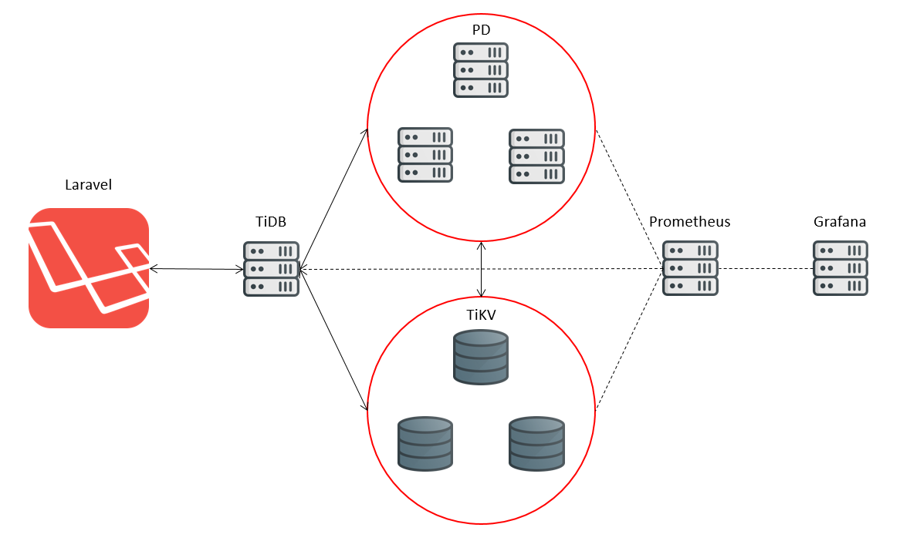

2. Penjelasan Arsitektur
    - Laravel  
        - PSDM - localhost (dijalankan pada host)
    - Placement Drivers
        - pd1 - 192.168.16.129
        - pd2 - 192.168.16.130        
        - pd3 - 192.168.16.131
    - TiKV
        - tikv1 - 192.168.16.139
        - tikv2 - 192.168.16.140
        - tikv3 - 192.168.16.141
    - TiDB
        - tidb - 192.168.16.149
    - Prometheus
        - promserver - 192.168.16.159
    - Grafana
        - grafana  - 192.168.16.160

## Implmentasi Sistem

1. Prasyarat
    - [Docker Desktop](https://www.docker.com/)
    - PingCAP PD docker instance
        ```
        docker pull pingcap/pd
        ```        
    - PingCAP TiKV docker instance
        ```
        docker pull pingcap/tikv
        ```
    - PingCAP TiDB docker instance
        ```
        docker pull pingcap/tidb
        ```
    - Aplikasi Laravel (PSDM)        

2. Membuat instance PD

    ```
    docker run -d --name pd1 ^
        --net tidbnet ^
        --ip 192.168.16.129 ^
        -p 51001:2379 ^
        -p 52001:2380 ^
        pingcap/pd:latest ^
        --name="pd1" ^
        --client-urls="http://0.0.0.0:2379" ^
        --advertise-client-urls="http://192.168.16.129:2379" ^
        --peer-urls="http://0.0.0.0:2380" ^
        --advertise-peer-urls="http://192.168.16.129:2380" ^
        --initial-cluster="pd1=http://192.168.16.129:2380,pd2=http://192.168.16.130:2380,pd3=http://192.168.16.131:2380"

    docker run -d --name pd2 ^
        --net tidbnet ^
        --ip 192.168.16.130 ^
        -p 51002:2379 ^
        -p 52002:2380 ^
        pingcap/pd:latest ^
        --name="pd2" ^
        --client-urls="http://0.0.0.0:2379" ^
        --advertise-client-urls="http://192.168.16.130:2379" ^
        --peer-urls="http://0.0.0.0:2380" ^
        --advertise-peer-urls="http://192.168.16.130:2380" ^
        --initial-cluster="pd1=http://192.168.16.129:2380,pd2=http://192.168.16.130:2380,pd3=http://192.168.16.131:2380"

    docker run -d --name pd3 ^
        --net tidbnet ^
        --ip 192.168.16.131 ^
        -p 51003:2379 ^
        -p 52003:2380 ^
        pingcap/pd:latest ^
        --name="pd3" ^
        --client-urls="http://0.0.0.0:2379" ^
        --advertise-client-urls="http://192.168.16.131:2379" ^
        --peer-urls="http://0.0.0.0:2380" ^
        --advertise-peer-urls="http://192.168.16.131:2380" ^
        --initial-cluster="pd1=http://192.168.16.129:2380,pd2=http://192.168.16.130:2380,pd3=http://192.168.16.131:2380"
    ```

3. Membuat instance TiKV

    ```
    docker run -d --name tikv1 ^
        --net tidbnet ^
        --ip 192.168.16.139 ^
        -p 53001:20160 ^
        pingcap/tikv:latest ^
        --addr="0.0.0.0:20160" ^
        --advertise-addr="192.168.16.139:20160" ^
        --pd="192.168.16.129:2379,192.168.16.130:2379,192.168.16.131:2379"

    docker run -d --name tikv2 ^
        --net tidbnet ^
        --ip 192.168.16.140 ^
        -p 53002:20160 ^
        pingcap/tikv:latest ^
        --addr="0.0.0.0:20160" ^
        --advertise-addr="192.168.16.140:20160" ^
        --pd="192.168.16.129:2379,192.168.16.130:2379,192.168.16.131:2379"

    docker run -d --name tikv3 ^
        --net tidbnet ^
        --ip 192.168.16.141 ^
        -p 53003:20160 ^
        pingcap/tikv:latest ^
        --addr="0.0.0.0:20160" ^
        --advertise-addr="192.168.16.141:20160" ^
        --pd="192.168.16.129:2379,192.168.16.130:2379,192.168.16.131:2379"
    ```

4. Membuat instance TiDB

    ```
    docker run -d --name tidb ^
        --net tidbnet ^
        --ip 192.168.16.149 ^
        -p 4000:4000 ^
        -p 10080:10080 ^
        pingcap/tidb:latest ^
        --store=tikv ^
        --path="192.168.16.129:2379,192.168.16.130:2379,192.168.16.131:2379"
    ```

5. Menyambungkan Aplikasi Laravel dengan TiDB
    - Menginstall dependensi TiDB
        ```
        composer require evvo/tidb-laravel:0.1
        ```
    - Mengubah driver mysql
        ```
        'mysql' => [
            'driver' => 'tidb',
            'host' => env('DB_HOST', '127.0.0.1'),
            ...
        ```
    - Menyesuaikan env
        ```
        ...
        DB_CONNECTION=mysql
        DB_HOST=127.0.0.1
        DB_PORT=4000
        DB_DATABASE=psdm
        DB_USERNAME=root
        DB_PASSWORD=
        ...
        ```

## Testing

1. Kegunaan Aplikasi
    - Memasukkan data RMP baru
    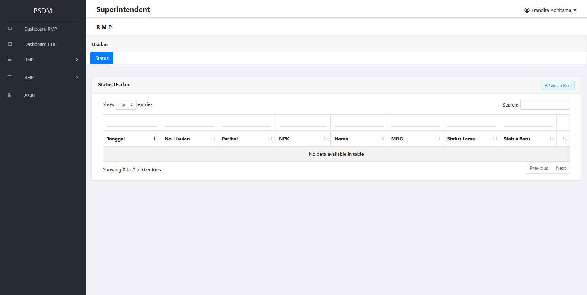
    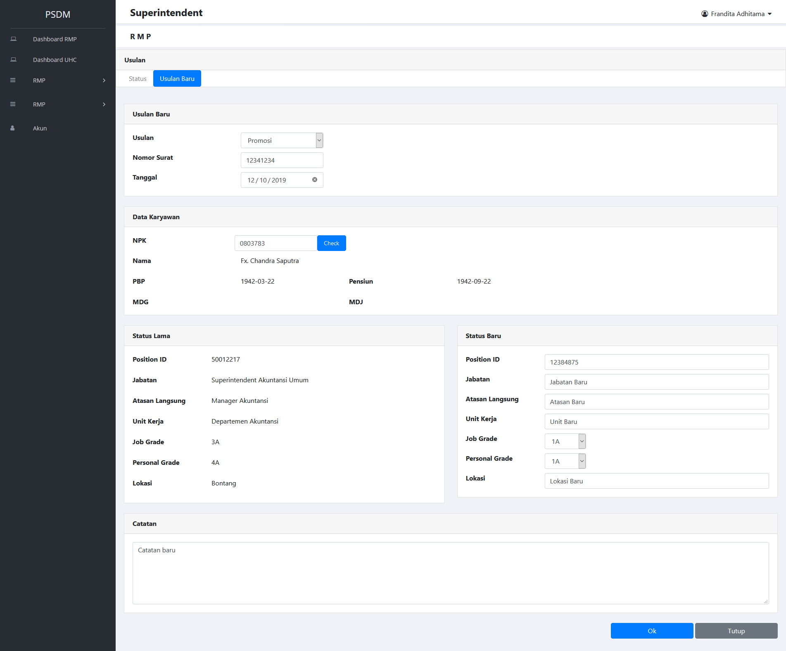
    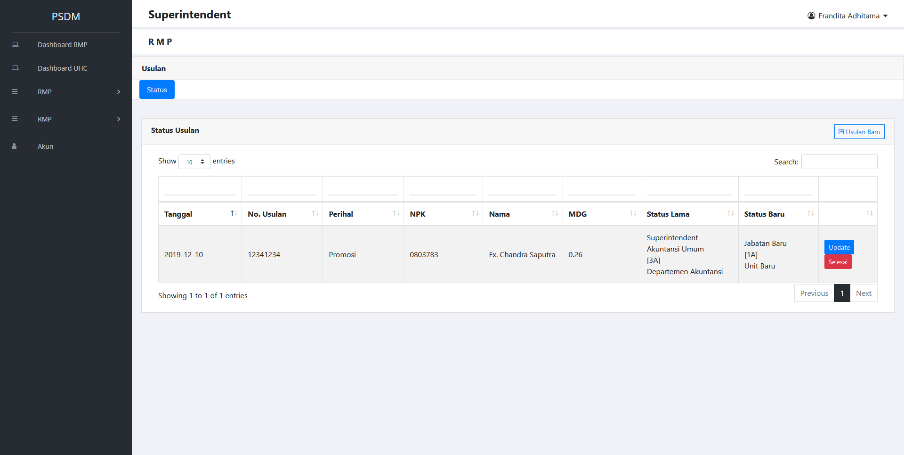
    
2. JMeter
    - 100
        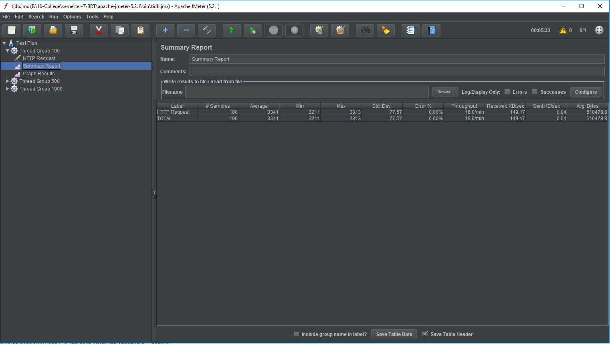
    - 500
        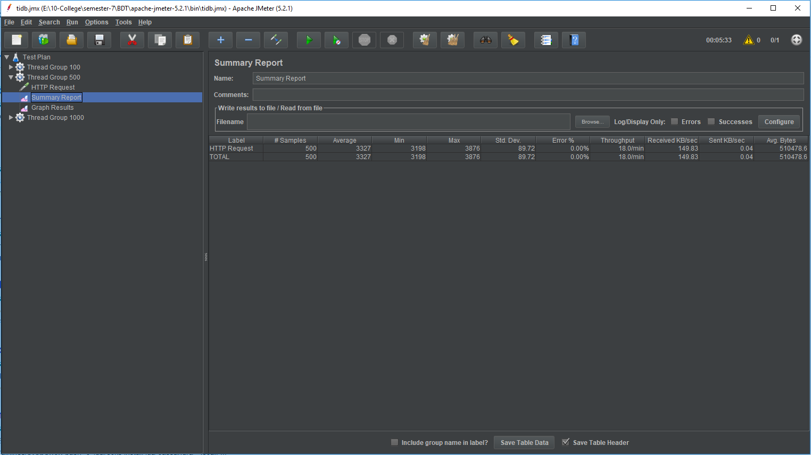
    - 1000
        
3. Sysbench
    - 3 Placement Driver  
        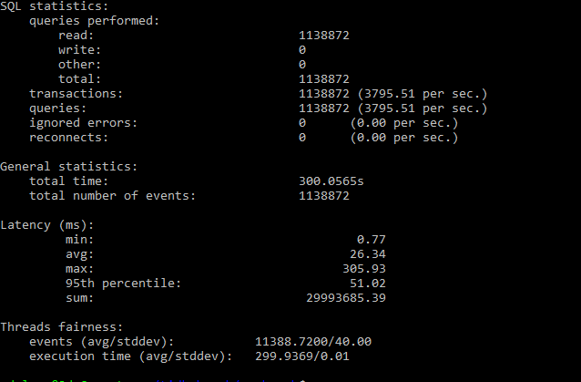
    - 2 Placement Driver  
        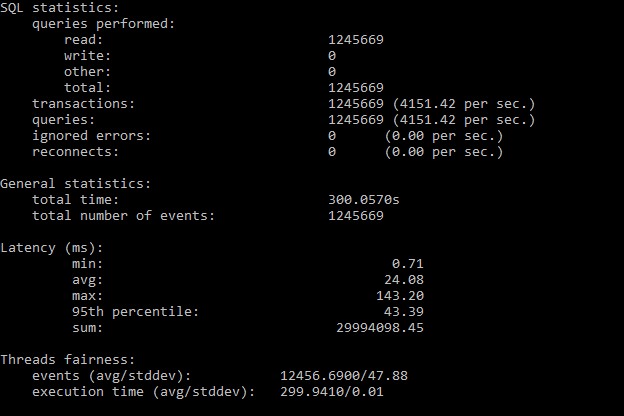
    - 1 Placement Driver  
        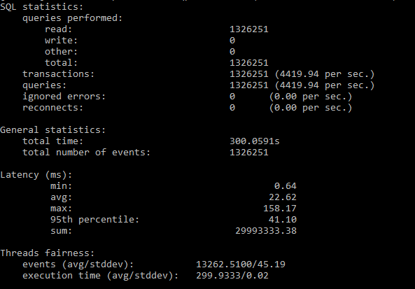

## Failover

1. Mengecek PD leader
    
2. Mematikan instance PD leader
    ```
    docker stop pd1
    ```
3. Mengecek PD leader pada Instance yang menyala
    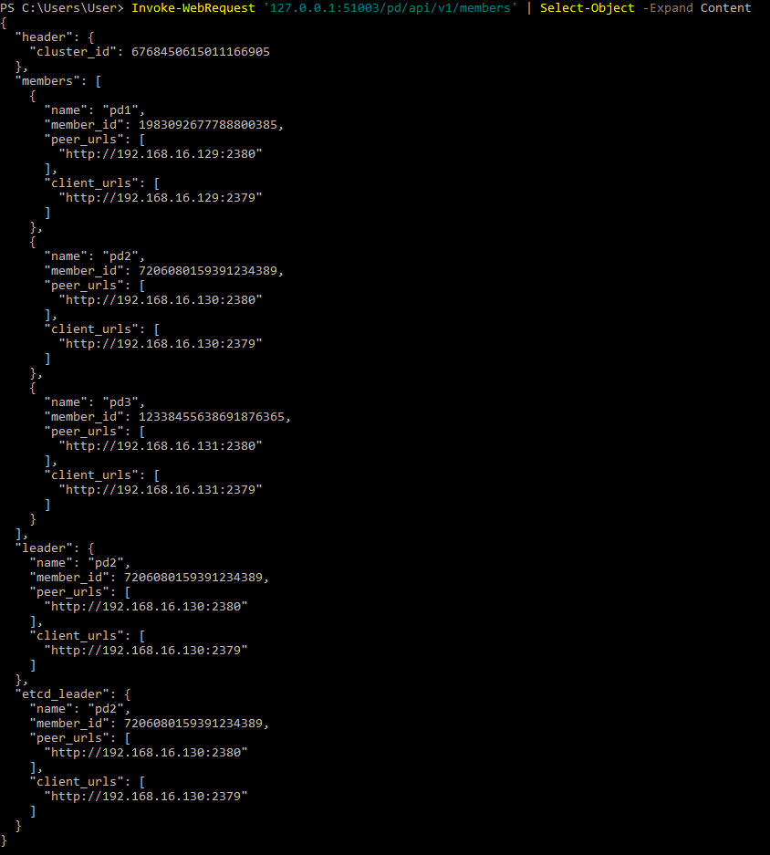

## Monitoring

1. Prometheus
    - Deskripsi
    - Meletakkan node exporter pada setiap instance
        ```
        docker cp ./prometheus/node_exporter-0.18.1.linux-amd64/node_exporter pd1:/
        docker cp ./prometheus/node_exporter-0.18.1.linux-amd64/node_exporter pd2:/
        docker cp ./prometheus/node_exporter-0.18.1.linux-amd64/node_exporter pd3:/
        docker cp ./prometheus/node_exporter-0.18.1.linux-amd64/node_exporter tikv1:/
        docker cp ./prometheus/node_exporter-0.18.1.linux-amd64/node_exporter tikv2:/
        docker cp ./prometheus/node_exporter-0.18.1.linux-amd64/node_exporter tikv3:/
        docker cp ./prometheus/node_exporter-0.18.1.linux-amd64/node_exporter tidb:/

        docker exec -d -it pd1 ./node_exporter
        docker exec -d -it pd2 ./node_exporter
        docker exec -d -it pd3 ./node_exporter
        docker exec -d -it tikv1 ./node_exporter
        docker exec -d -it tikv2 ./node_exporter
        docker exec -d -it tikv3 ./node_exporter
        docker exec -d -it tidb ./node_exporter
        ```
    - Membuat instance prometheus
        ```
        docker run -d ^
            --name promserver ^
            --net tidbnet ^
            --ip 192.168.16.159 ^
            -p 9090:9090 ^
            -v "E:/10-College/semester-7/BDT/basis-data-terdistribusi/fp/prometheus/prometheus.yml:/etc/prometheus/prometheus.yml" ^
            prom/prometheus ^
            --config.file=/etc/prometheus/prometheus.yml
        ```
    - Mengakses Prometheus pada localhost:9090
        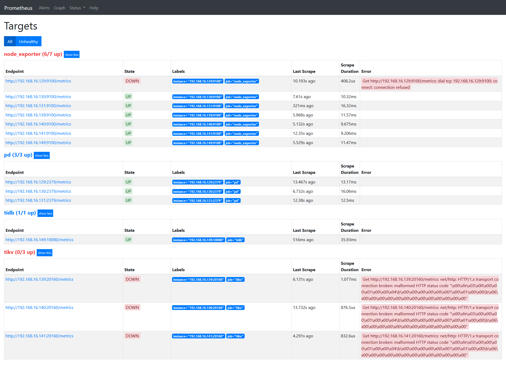

2. Grafana
    - Deskripsi
    - Membuat instance Grafana
        ```
        docker run -d ^
            --name grafana ^
            --net tidbnet ^
            --ip 192.168.16.160 ^
            -p 3000:3000 ^
            -v "E:/10-College/semester-7/BDT/basis-data-terdistribusi/fp/grafana/grafana.ini:/conf/grafana.ini" ^
            grafana/grafana ^
            --config="/conf/grafana.ini"
        ```
    - Menyambungkan grafana dengan prometheus
    - TiDB
        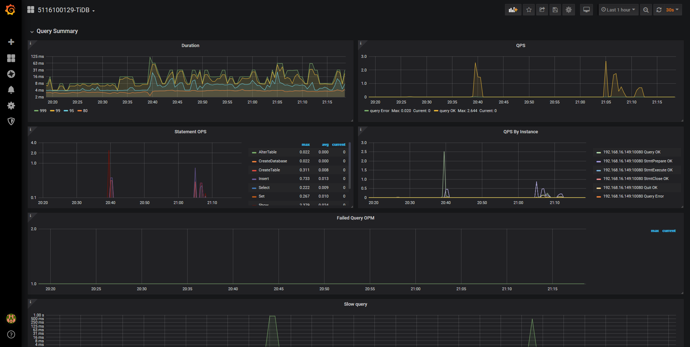
    - TiKV
        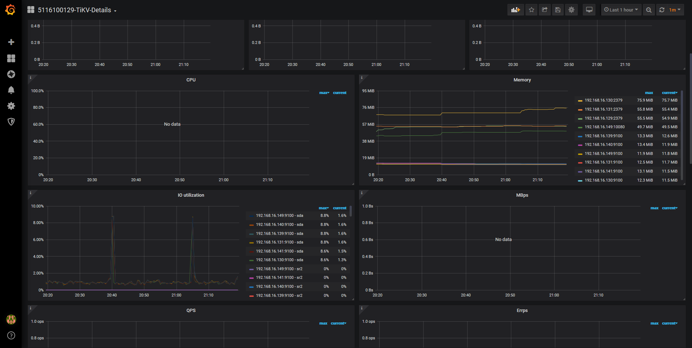
    - PD
        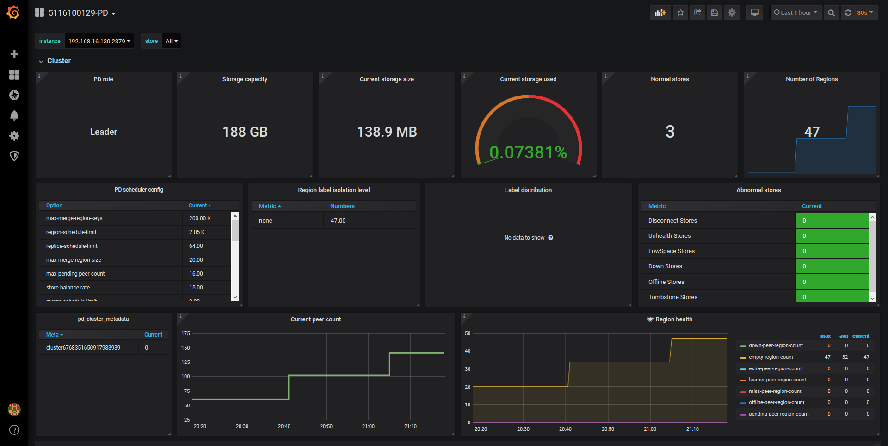