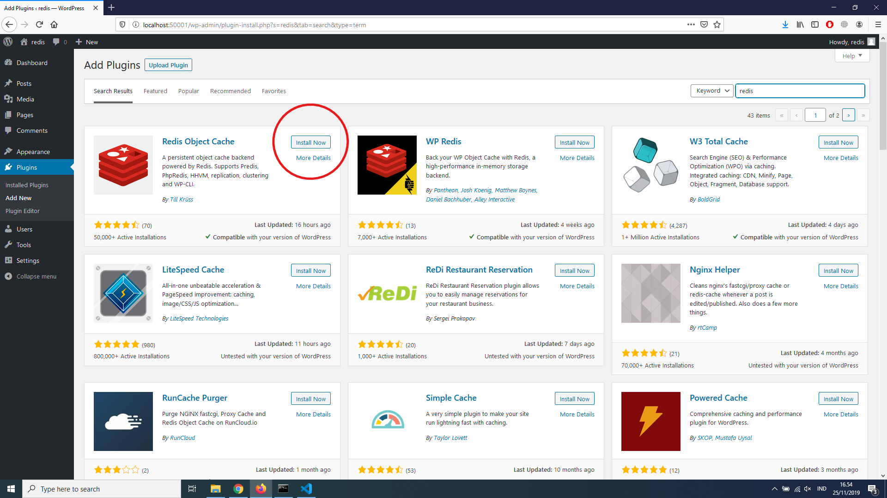
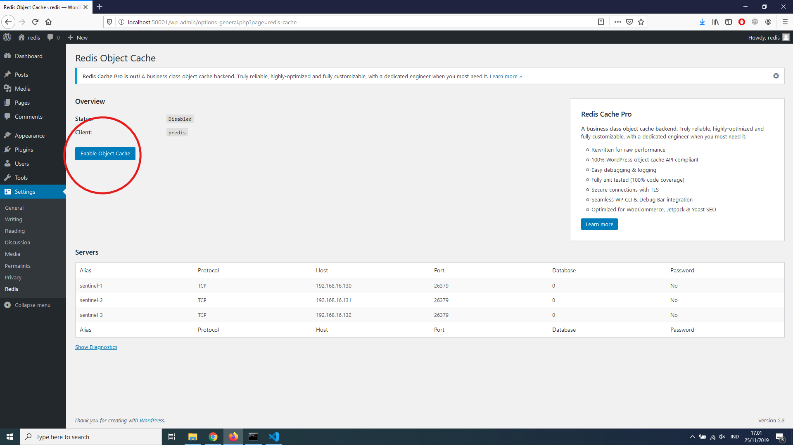
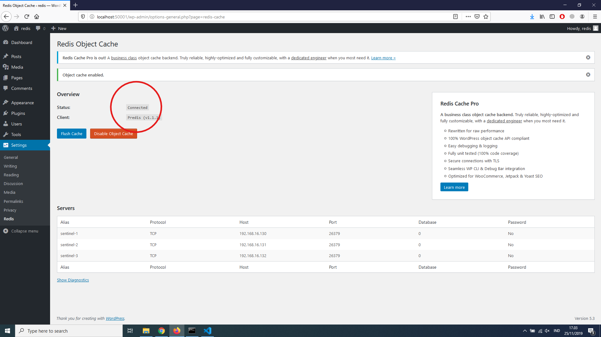
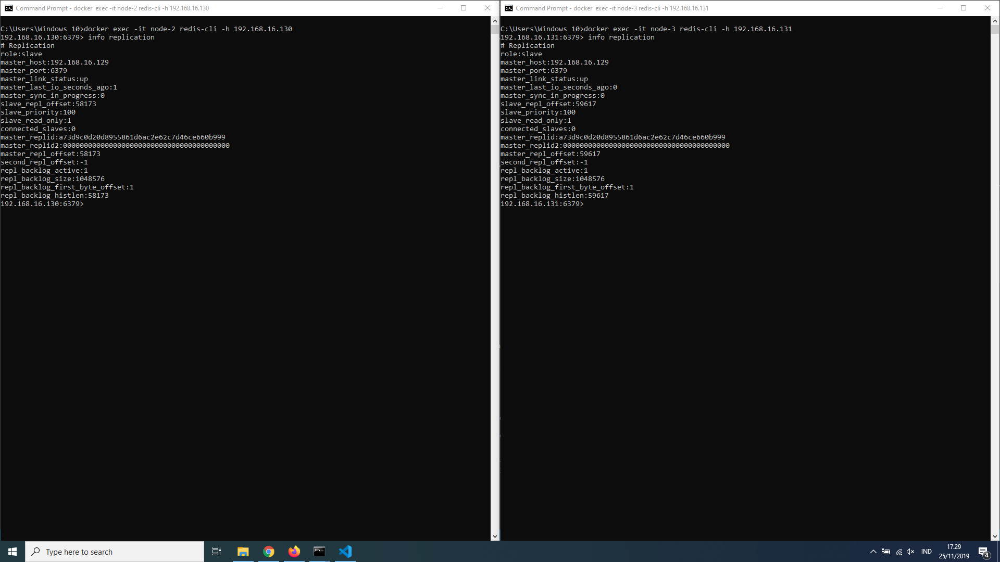
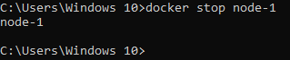
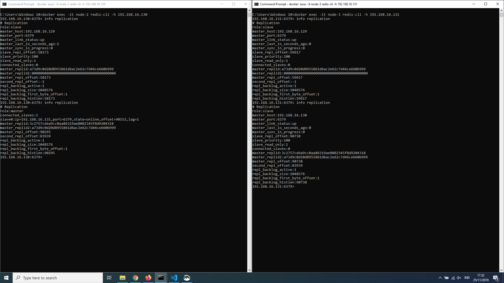
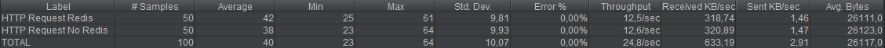
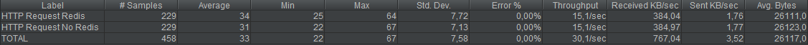
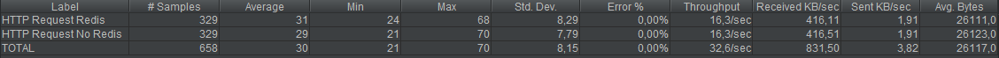

# Redis Replication Cluster with Sentinel

## Instalasi perangkat lunak

1. Docker Desktop
- Download docker desktop dari [website officialnya](https://www.docker.com/)
2. Redis
    ```
    docker pull bitnami/redis
    ```
3. Redis Sentinel
    ```
    docker pull bitnami/redis-sentinel
    ```
4. MySQL
    ```
    docker pull mysql:5.7 
    ```
5. Wordpress
    ```
    docker pull wordpress:5.3.0-apache
    ```

## Instalasi redis dan redis sentinel
1. Membuat network (*dijalankan sekali*)
    ```
    docker network create --subnet=192.168.16.0/24 redisnet
    ```
2. Membuat 1 node redis server sebagai master
    ```
    docker run -d --net redisnet --ip 192.168.16.129 -p 6381:6379 --name node-1 --hostname node-1 -e REDIS_REPLICATION_MODE=master -e ALLOW_EMPTY_PASSWORD=yes bitnami/redis
    ```
3. Membuat 2 node redis server sebagai slave
    ```
    docker run -d --net redisnet --ip 192.168.16.130 -p 6382:6379 --name node-2 --hostname node-2 -e REDIS_REPLICATION_MODE=slave -e REDIS_MASTER_HOST=192.168.16.129 -e REDIS_MASTER_PORT_NUMBER=6379 -e ALLOW_EMPTY_PASSWORD=yes bitnami/redis
    docker run -d --net redisnet --ip 192.168.16.131 -p 6383:6379 --name node-3 --hostname node-3 -e REDIS_REPLICATION_MODE=slave -e REDIS_MASTER_HOST=192.168.16.129 -e REDIS_MASTER_PORT_NUMBER=6379 -e ALLOW_EMPTY_PASSWORD=yes bitnami/redis
    ```
4. Membuat 3 node redis sentinel
    ```
    docker run -d --net redisnet --ip 192.168.16.132 -p 26381:26379 --name sentinel-1 --hostname sentinel-1 -e REDIS_MASTER_HOST=192.168.16.129 -e REDIS_MASTER_PORT_NUMBER=6379  -e REDIS_SENTINEL_QUORUM=2 bitnami/redis-sentinel
    docker run -d --net redisnet --ip 192.168.16.133 -p 26382:26379 --name sentinel-2 --hostname sentinel-2 -e REDIS_MASTER_HOST=192.168.16.129 -e REDIS_MASTER_PORT_NUMBER=6379  -e REDIS_SENTINEL_QUORUM=2 bitnami/redis-sentinel
    docker run -d --net redisnet --ip 192.168.16.134 -p 26383:26379 --name sentinel-3 --hostname sentinel-3 -e REDIS_MASTER_HOST=192.168.16.129 -e REDIS_MASTER_PORT_NUMBER=6379  -e REDIS_SENTINEL_QUORUM=2 bitnami/redis-sentinel
    ```

## Instalasi WordPress
1. Membuat 1 node mysql *karena mysql menjadi dependensi wordpress*
    ```
    docker run -d --net redisnet --ip 192.168.16.135 -p 33060:3306 --name mysql --hostname mysql -e MYSQL_ROOT_PASSWORD=root mysql:5.7
    ```
2. Membuat 2 database untuk wordpress
    ```
    docker exec -d -it mysql mysql -uroot -proot -e "create database redistest;"
    docker exec -d -it mysql mysql -uroot -proot -e "create database noredis;"
    ```
2. Membuat 1 node wordpress yang menggunakan redis
    ```
    docker run -d --net redisnet --ip 192.168.16.136 -p 50001:80 --name wordpress --hostname wordpress -e WORDPRESS_DB_HOST=192.168.16.135 -e WORDPRESS_DB_USER=root -e WORDPRESS_DB_PASSWORD=root -e WORDPRESS_DB_NAME=redistest -e WORDPRESS_CONFIG_EXTRA="define('WP_REDIS_CLIENT', 'predis'); define('WP_REDIS_SENTINEL', 'mymaster');define('WP_REDIS_SERVERS',['tcp://192.168.16.132:26379?alias=sentinel-1','tcp://192.168.16.133:26379?alias=sentinel-2','tcp://192.168.16.134:26379?alias=sentinel-3']);define('WP_CACHE',true);" wordpress:5.3.0-apache
    ```
    WordPress dengan redis dapat diakses pada [localhost:50001](localhost:50001)  

3. Membuat 1 node wordpress yang tidak menggunakan redis
    ```
    docker run -d --net redisnet --ip 192.168.16.137 -p 40001:80 --name wordpress-nr --hostname wordpress -e WORDPRESS_DB_HOST=192.168.16.135 -e WORDPRESS_DB_USER=root -e WORDPRESS_DB_PASSWORD=root -e WORDPRESS_DB_NAME=noredis wordpress:5.3.0-apache
    ```
    WordPress tanpa redis dapat diakses pada [localhost:40001](localhost:40001)


## Menyambungkan Redis dengan WordPress
1. Memasang plugin Redis Object Cache
    
2. Membenarkan bug pada plugin agar bisa berjalan dengan cara menjalankan perintah berikut
    ```
    docker exec -it wordpress sed -i "s/return 'INFO'/return 'info'/g" /var/www/html/wp-content/plugins/redis-cache/includes/predis/src/Command/ServerInfo.php
    ```
3. Menyalakan plugin redis
    
4. Status Connected
    

## Percobaan Failover
1. Masuk kedalam salah satu slave dan mengecek *cluster/replication* info
    ```
    docker exec -it node-2 redis-cli
    ```  
    
2. Membuka *command line/terminal* lain dan mematikan *node* yang menjadi *master*  
    
3. Menjalankan request ke WordPress      
4. Masuk kedalam salah satu slave dan mengecek  
    

## Benchmarking menggunakan JMeter
1. Percobaan 50 loop
    
1. Percobaan 229 loop
    
1. Percobaan 329 loop
    